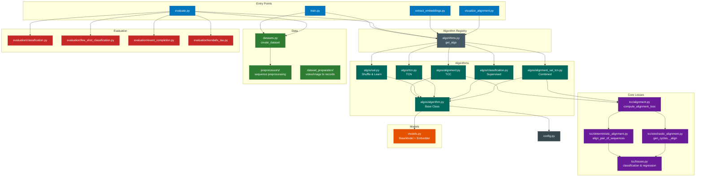
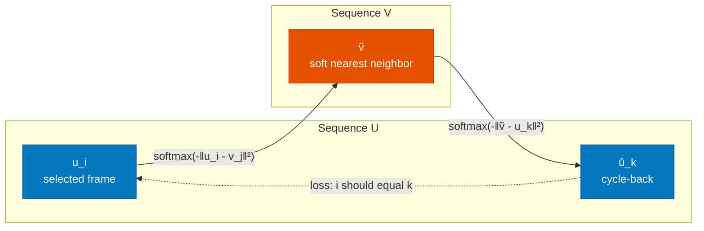
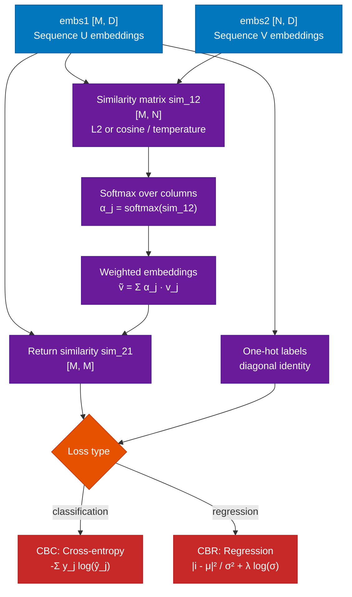
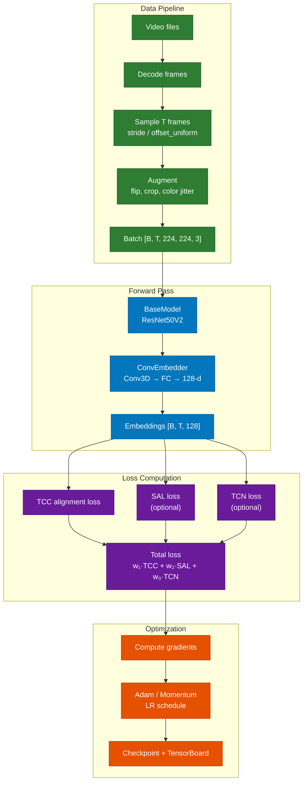
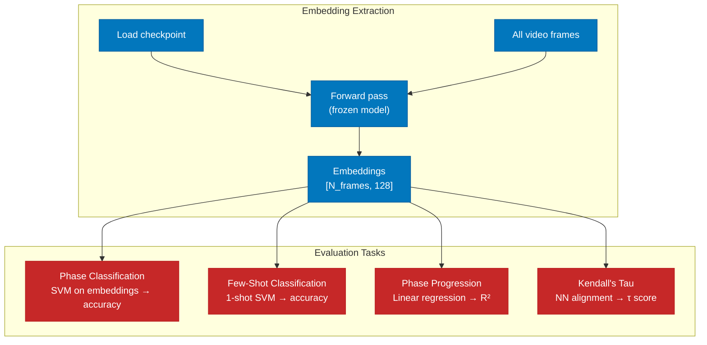
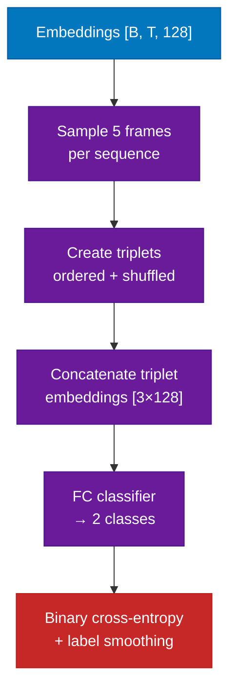
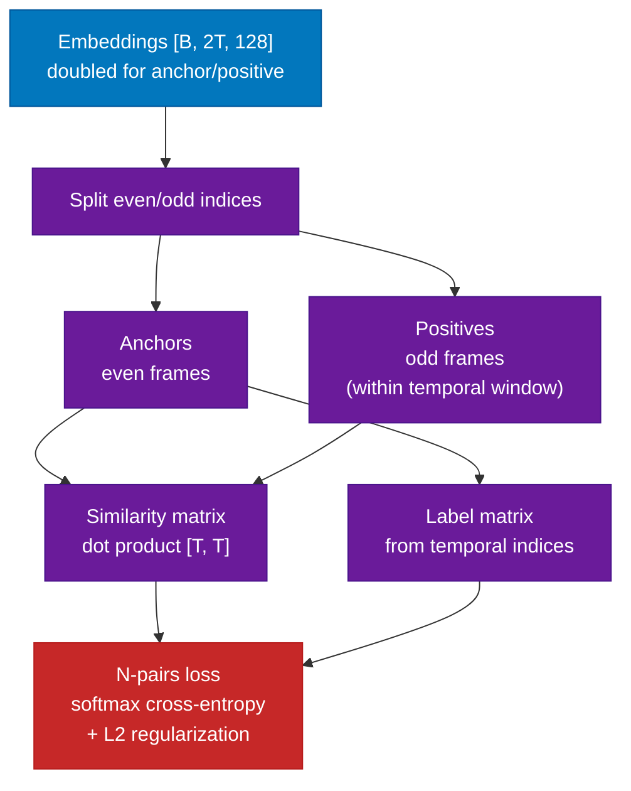
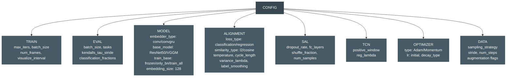

# Temporal Cycle-Consistency Learning

PyTorch implementation of [Temporal Cycle-Consistency Learning](https://arxiv.org/abs/1904.07846) (Dwibedi et al., CVPR 2019).

Self-supervised representation learning on videos by exploiting temporal cycle-consistency constraints. Useful for fine-grained sequential/temporal understanding tasks.

**Additional reference:** [Time-Contrastive Networks](https://arxiv.org/abs/1704.06888) (Sermanet et al., 2017)

## Branch Structure

- **`main`** — PyTorch implementation
- **`tf2`** — Original Keras/TF2 codebase (archived reference)

## Dataset

The **multiview pouring dataset** is sourced from HuggingFace
([`sermanet/multiview-pouring`](https://huggingface.co/datasets/sermanet/multiview-pouring))
and processed into per-frame images for PyTorch training.

### Two-notebook pipeline

The data and training workflow is split into two notebooks under
`notebooks/self-supervised/`:

| Notebook | Purpose |
|----------|---------|
| `tcc_data_prep.ipynb` | Download raw videos from HuggingFace, extract frames, optionally upload to S3 |
| `tcc_training.ipynb` | Load processed data, train TCC models (D=32/64/128), evaluate and visualize |

### Storage backends

Configured in `configs/pouring.yaml` via `storage_backend`:

| Backend | When to use | Data flow |
|---------|-------------|-----------|
| **`s3`** (default) | GPU nodes with MinIO access | Data-prep uploads to S3; training downloads from S3 to local cache |
| **`local`** | Colab, laptops, no S3 available | Both notebooks read/write under `data/` |

The `data/` directory is a **local cache** — it is regenerated automatically
by the notebooks and does not need to be checked in or preserved.

### Quick start

```bash
# Inside the devcontainer:
make data-prep          # Stage 1: download + process
make train              # Stage 2: train + evaluate
make pipeline           # Both stages sequentially
```

## Self-supervised Algorithms

- Temporal Cycle-Consistency (TCC)
- Shuffle and Learn
- Time-Contrastive Networks (TCN)
- Combined methods
- Supervised baseline (per-frame classification)

## Evaluation Tasks

- Phase classification
- Few-shot phase classification
- Phase progression
- Kendall's Tau

---

## Architecture

### Module Dependency Diagram



### Embedding Network Architecture

The embedder transforms raw video frames into 128-dimensional embeddings used for alignment.

```mermaid
graph LR
    subgraph Input
        FR["Frames<br/>[B, T, 224, 224, 3]"]
    end

    subgraph "BaseModel (ResNet50V2)"
        R5["ResNet50V2<br/>pretrained ImageNet"]
        CF["Conv4c features<br/>[B, T, 14, 14, 1024]"]
    end

    subgraph "ConvEmbedder"
        CX["Context stacking<br/>k-1 neighbor frames"]
        C3["Conv3D layers<br/>temporal aggregation"]
        MP["3D MaxPooling"]
        F1["FC 512 + ReLU"]
        F2["FC 512 + ReLU"]
        LP["Linear projection"]
        LN["L2 Normalize"]
    end

    subgraph Output
        EM["Embeddings<br/>[B, T, 128]"]
    end

    FR --> R5 --> CF --> CX --> C3 --> MP --> F1 --> F2 --> LP --> LN --> EM

    classDef input fill:#0277bd,color:#fff,stroke:#01579b
    classDef backbone fill:#e65100,color:#fff,stroke:#bf360c
    classDef embedder fill:#6a1b9a,color:#fff,stroke:#4a148c
    classDef output fill:#2e7d32,color:#fff,stroke:#1b5e20

    class FR input
    class R5,CF backbone
    class CX,C3,MP,F1,F2,LP,LN embedder
    class EM output
```



**Alternative embedder:** ConvGRUEmbedder replaces Conv3D + MaxPool with Conv2D per frame followed by GRU layers for temporal modeling.

### TCC Loss Computation

The core TCC loss enforces cycle-consistency across video pairs through soft nearest neighbor matching.

#### Cycle-Consistency Principle



#### Deterministic Alignment Pipeline



#### Loss Variants

**Cycle-Back Classification (CBC):**
Cross-entropy loss on the cycle-back logits, treating each frame position as a class.

```
L_cbc = -Σⱼ yⱼ log(ŷⱼ)
```

**Cycle-Back Regression (CBR):**
Fits a Gaussian to the cycle-back distribution and penalizes distance from the true index with variance regularization.

```
β = softmax(logits)
μ = Σ(steps · β)        # predicted time index
σ² = Σ(steps² · β) - μ² # predicted variance
L_cbr = |i - μ|² / σ² + λ · log(σ)
```

CBR with λ=0.001 outperforms CBC and MSE variants (paper ablation).

#### Stochastic vs Deterministic

| Mode | Description |
|------|------------|
| **Deterministic** | Aligns all N*(N-1) pairs in batch. Concatenates logits/labels from all pairs. |
| **Stochastic** | Generates random cycles of configurable length (2+). Randomly selects frames and cycles through sequences. More scalable for large batches. |

### Training Pipeline



#### Training Configuration

| Parameter | Default | Notes |
|-----------|---------|-------|
| Image size | 224×224 | ResNet50 input |
| Embedding dim | 128 | L2-normalized |
| Context frames | k (configurable) | Temporal context for Conv3D |
| Batch size | configurable | N sequences per batch |
| Optimizer | Adam / Momentum | With LR decay (fixed/exp/manual) |
| Similarity | L2 or cosine | Scaled by temperature |
| Loss type | CBR (regression_mse_var) | Best performing variant |

### Evaluation Pipeline

Evaluation extracts frozen embeddings and trains lightweight classifiers on top — no fine-tuning of the pretrained model.



| Task | Method | Metric | Description |
|------|--------|--------|-------------|
| Phase Classification | SVM on embeddings | Accuracy | Classify action phase per frame |
| Few-Shot Classification | 1-shot SVM | Accuracy | Single labeled video for training |
| Phase Progression | Linear regression | R² | Predict fraction of task completion |
| Kendall's Tau | NN alignment | τ ∈ [-1, 1] | Temporal concordance between video pairs |

### Shuffle and Learn (SAL) Loss

SAL trains the embedder to distinguish temporally ordered from shuffled frame sequences.



**Algorithm:**
1. Randomly select 5 frame indices from each sequence
2. Form ordered triplets (f₁, f₂, f₃) where f₁ < f₂ < f₃
3. Form shuffled triplets by swapping positions
4. Concatenate 3 frame embeddings → 384-dim vector
5. FC classifier predicts ordered vs shuffled → binary cross-entropy

### TCN (Time-Contrastive Networks) Loss

TCN uses an N-pairs metric learning loss on temporally sampled anchor/positive frame pairs.



**N-pairs loss:**
```
L_tcn = softmax_cross_entropy(anchors · positives^T, labels) + λ · (‖anchors‖² + ‖positives‖²)
```

The positive window controls how far apart anchor/positive frames can be temporally. L2 regularization (λ) prevents embedding collapse.

### Combined Loss (TCC + SAL + TCN)

The combined algorithm (`alignment_sal_tcn`) computes a weighted sum:

```
L_total = w_align · L_tcc + w_sal · L_sal + w_tcn · L_tcn
```

Weights are configurable via `CONFIG.ALIGNMENT_SAL_TCN.ALIGNMENT_LOSS_WEIGHT` and `SAL_LOSS_WEIGHT`. The paper shows that TCC+TCN achieves the best performance on fine-grained temporal tasks.

### Configuration Structure



### PyTorch Migration Map

Key TensorFlow → PyTorch equivalences for the port:

| TensorFlow | PyTorch | Used in |
|------------|---------|---------|
| `tf.keras.Model` | `nn.Module` | All algorithm/model classes |
| `tf.nn.l2_normalize` | `F.normalize` | Embedding normalization |
| `tf.nn.softmax` | `F.softmax` | Soft nearest neighbor |
| `tf.matmul` | `torch.matmul` / `@` | Similarity computation |
| `tf.GradientTape` | `loss.backward()` | Training loop |
| `tf.stop_gradient` | `.detach()` | Loss computation |
| `tf.data.TFRecordDataset` | `torch.utils.data.Dataset` | Data loading |
| `tf.keras.layers.Conv3D` | `nn.Conv3d` | Temporal convolutions |
| `tf.keras.layers.Dense` | `nn.Linear` | FC layers |
| `CuDNNGRU` | `nn.GRU` | ConvGRU embedder |
| `tf.distribute.MirroredStrategy` | `DistributedDataParallel` | Multi-GPU |
| `tf.summary` | `torch.utils.tensorboard` | Logging |
| `tf.keras.backend.learning_phase()` | `model.train()/eval()` | Train/eval mode |
| `tf.image.*` augmentations | `torchvision.transforms` | Data augmentation |
| EasyDict config | dataclasses / OmegaConf | Configuration |

---

## Numerical Stability: TF2 vs PyTorch Port

### Symptom

All three embedding-dimension sweeps (D=32, D=64, D=128) trained to 5 000
iterations without raising an error, yet **every checkpoint from iteration
1 000 onward contained NaN weights**. The 50-iteration debug checkpoint was
clean, so NaN appeared between step 50 and step 1 000 of the first full run.

The corruption was discovered when the analysis cells in
`tcc_training.ipynb` called `sklearn.decomposition.PCA` on the extracted
embeddings and received:

```
ValueError: Input X contains NaN.
```

Inspection of the saved checkpoints confirmed that **172 of 278 tensors**
had NaN values, spanning every BatchNorm layer in the ResNet-50 backbone
(`cnn.backbone`) and all layers in the ConvEmbedder (`emb.*`).

### Root Cause

The training loop had **no gradient clipping**, and the similarity scores
computed inside the cycle-consistency alignment could grow unbounded before
being passed to `F.softmax`.

The chain of events:

1. Similarity is computed as L2 distance (or cosine), then divided by the
   number of embedding channels **and** by the temperature (default 0.1,
   i.e. multiplied by 10).
2. With 32-dimensional embeddings and temperature 0.1, a raw L2 distance of
   ~160 becomes a similarity of `160 / 32 / 0.1 = 50`, which is already
   near the edge of float32 softmax stability.
3. `F.softmax` on values > ~88 produces `inf`; subsequent weighted averaging
   yields `NaN` query features.
4. NaN propagates through the cycle back to the loss, producing NaN gradients.
5. Because the config uses `train_base: only_bn`, only BatchNorm parameters
   receive gradient updates. NaN gradients corrupt the BN weights first,
   then the BN running statistics, then the embedder layers via the next
   forward pass.
6. Checkpoints saved after NaN onset are permanently corrupted.

### Why TF2 Did Not Exhibit This

The original TF2 implementation (branch `tf2`) uses **identical defaults**:

| Parameter | TF2 | PyTorch |
|-----------|-----|---------|
| `loss_type` | `regression_mse_var` | `regression_mse_var` |
| `temperature` | 0.1 | 0.1 |
| `similarity_type` | l2 | l2 |
| `label_smoothing` | 0.1 | 0.1 |
| `huber_delta` | 0.1 | 0.1 |
| `variance_lambda` | 0.001 | 0.001 |
| `normalize_indices` | True | True |

The TF2 code also has **no explicit gradient clipping or similarity clamping**.
TensorFlow's implicit numerical safeguards (stable softmax kernel, degenerate
gradient masking, float handling) mask borderline instabilities that surface
in PyTorch. PyTorch's `F.softmax` is also numerically stable (subtracts max),
but preceding divisions can still produce `inf` values that defeat the
max-subtraction trick when the dynamic range is extreme.

### Fixes Applied

**1. Gradient clipping (`algorithm.py`)**

```python
# src/tcc/algos/algorithm.py  —  train_one_iter()
total_loss.backward()
torch.nn.utils.clip_grad_norm_(self.parameters(), max_norm=10.0)  # NEW
optimizer.step()
```

**2. Similarity clamping — stochastic alignment (`stochastic_alignment.py`)**

```python
# src/tcc/stochastic_alignment.py  —  _align_single_cycle()
similarity = similarity / float(num_channels)
similarity = similarity / temperature
similarity = similarity.clamp(-50.0, 50.0)  # NEW
beta = F.softmax(similarity, dim=0)
```

The clamp range `[-50, 50]` is chosen so that `exp(50) ≈ 5.2e21`, well
within float32 range (`~3.4e38`). For comparison, `exp(88) ≈ 1.6e38` is
the approximate overflow threshold.

**3. Similarity clamping — deterministic alignment (`deterministic_alignment.py`)**

```python
# src/tcc/deterministic_alignment.py  —  get_scaled_similarity()
similarity = similarity / channels
similarity = similarity / temperature
similarity = similarity.clamp(-50.0, 50.0)  # NEW
return similarity
```

### Alternative Loss Types

| Loss type | Description | Numerical notes |
|-----------|-------------|-----------------|
| `regression_mse` | Mean squared error on predicted time | Can amplify outlier gradients |
| `regression_mse_var` | MSE with learned variance weighting | Default; `log(var)` can → `-inf` if variance collapses |
| `regression_huber` | Huber loss (delta=0.1) | More robust to outliers; clips large gradients inherently |
| `classification` | Cross-entropy on softmax logits | Different formulation; not directly comparable |

If gradient issues persist after the fixes above, switching to
`regression_huber` provides an additional safety margin because the Huber
loss transitions from quadratic to linear for residuals larger than `delta`,
effectively capping the gradient magnitude from the loss itself.

### Verification

After applying the fixes, re-run training and verify:

```bash
# Inside the devcontainer on gpu-node-3:
make train

# Then check checkpoints for NaN:
python3 -c "
import torch
for d in [32, 64, 128]:
    ckpt = torch.load(f'runs_tutorial/pouring_tcc_d{d}/checkpoint_5000.pt',
                       map_location='cpu', weights_only=False)
    sd = ckpt.get('model_state_dict', {})
    nan_count = sum(1 for v in sd.values() if torch.isnan(v).any())
    print(f'd={d}: {nan_count}/{len(sd)} tensors with NaN')
"
```

Expected output after fix: `0/278 tensors with NaN` for all three dimensions.

---

## Citation

If you found this paper/code useful in your research, please consider citing:

```bibtex
@InProceedings{Dwibedi_2019_CVPR,
  author = {Dwibedi, Debidatta and Aytar, Yusuf and Tompson, Jonathan and Sermanet, Pierre and Zisserman, Andrew},
  title = {Temporal Cycle-Consistency Learning},
  booktitle = {The IEEE Conference on Computer Vision and Pattern Recognition (CVPR)},
  month = {June},
  year = {2019},
}
```
